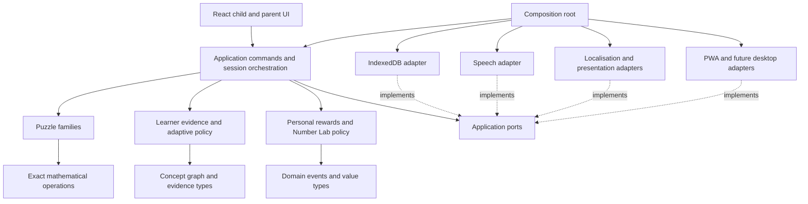

# Architecture

Status: accepted direction with pure Phase 1B domain, Phase 1C bounded application ports/integrity, preserved owner-confirmed Phase 1V and a current Phase 1D localisation/local-only speech ENGINEERING PASS. Learner persistence, adaptation, real puzzle families and PWA/offline behavior remain prospective. The diagram and answer/session flow below describe the fuller target; current ports are maintained in [application ports](APPLICATION_PORTS.md) and the [Phase 1C report](PHASE_1C_COMPLETION_REPORT.md). Phase-specific evidence and limits belong in the [Phase 1V report](PHASE_1V_COMPLETION_REPORT.md) and [Phase 1D report](PHASE_1D_COMPLETION_REPORT.md).

## Runtime and dependency direction

Build a single application repository with internal TypeScript modules. Deliver static assets to a browser/PWA; run truth, adaptation and state locally. Node and pnpm are developer/build tools only, now pinned for Phase 1A. Python/FastAPI, backend, account and cloud learner store are outside V1. Tauri is a preferred future packaging candidate, not a present dependency.



Arrows mean imports; dotted arrows mean contract implementation. UI imports application view models/commands, not concrete storage/speech adapters. The composition root wires adapters. Infrastructure may use domain values/contracts; domain never imports application, adapters, React, DOM, IndexedDB, speech synthesis, service workers or Tauri. No infrastructure module owns mastery or mathematical truth.

The diagram describes the target architecture. The composition root mounts `src/ui/App.tsx` from `src/composition/main.tsx`; Phase 1V replaces the technical placeholder with `src/ui/prototype/`. `src/domain/README.md` records the implemented pure boundary and links the Phase 1B contracts. Separate TypeScript projects check browser source with ES/DOM/Vite types and no ambient Node types, tests/build tooling with Node types, and domain/application code without DOM or ambient Node/framework types. The OWNER/QC correction adds browser Node-module/global lint guards and negative probes alongside the existing domain restrictions. Historical scaffold gate results and limits belong in the [Phase 1A report](PHASE_1A_COMPLETION_REPORT.md).

The preserved Phase 1V intentionally imported only local UI/prototype modules, without an application command, session engine, repository, domain evaluator, speech or persistence adapter. Its fixed reducer/fixtures and tiny el-GR/en-GB copy supplied a bounded visual candidate. The owner-selected [Space visual baseline](adr/ADR-0011.md) replaces the historical three-alternative production switch; legacy `variant` queries remain ignored. Phase 1D changes the presentation boundary and composition wiring, while preserving scripted fixtures/reducer and accepted visuals. Typed message schemas and locale manifests own wording/formatting; semantic fixed speech plans own nonpersonal utterance construction. Infrastructure implements the existing generic speech port with browser SpeechSynthesis; composition injects it into the UI. UI does not call browser speech globals, and application/domain gain no DOM, timer, random or speech API dependency. See [ADR-0012](adr/ADR-0012.md).

The reconciliation makes shape matching visibly concrete and keeps help child-controlled near answers. Explore begins with one sixteen-tile array before the ordered representations. After a selection, that single array remains inside its step, retaining identical cells/coordinates and four-by-four sides/rows; there are no extra diagrams, overlays or automatic scrolling. The final root view highlights only four top tiles under one bracket labelled 4, with concrete square/side meaning before the concluding √16 = 4. Scripted outcomes must never become production mathematical truth. Badge/activity/exploration selections and all three language preferences remain transient, reset on reload and create no learner or exploratoryExposure evidence. This prototype does not implement the answer/commit flow below or accept the proposed production SVG/MathML strategies. Phase 1V is **FINAL PASS — OWNER CONFIRMED** and locally preserved. D37 authorizes Phase 1D, whose bounded checkpoint-6 engineering gate has passed. Local preservation follows final staged review; conditional Phase 1E remains unstarted until the preceding complete local gate and genuine browser lifecycle proof.

Phase 1D knows seven exact locales, with three draft prototype schemas and four planned/incomplete manifests. `uiLocale` owns chrome/navigation/accessibility UI wording; `instructionLocale` owns task/hint/relationship instruction wording; `numberSpeechLocale` owns spoken number/math plans. Browser language is not selection authority. Structured typed messages and Intl.PluralRules/Intl.NumberFormat require no new runtime dependency or generic ICU parser. Messages format fixed semantic values; they do not decide correctness or calculate a relationship. Principal √16 = 4 remains distinct from the solution set of x² = 16.

| Module | Owns | Cannot own |
| --- | --- | --- |
| domain/math | Exact values/operations, domain errors | Formatted text, storage, learner state |
| domain/puzzles | Semantic tasks, generators, validation, semantic hints | React rendering, translated strings |
| domain/learning | Graph, evidence transitions, recommendations/reasons | Device clocks, I/O, diagnoses |
| domain/game | Personal milestones/reward events, exploration policy | Mathematical access or correctness |
| application | Session commands, injected seed/time, ports, atomic effects | Reimplementing validation in handlers |
| presentation | Localised view/utterance plans, answer input parsing | Ground truth |
| infrastructure | Browser/native persistence, speech, caching, capability adapters | Pedagogical policy |
| ui | Accessible interaction and focus | Stored evidence mutation directly |

The application coordinates an answer: parse a structured answer at the presentation boundary; validate it in domain; produce one logical attempt outcome; compute evidence/recommendation and reward events; commit atomically through a persistence port; acknowledge save status; render localised feedback; optionally speak it. A failed save cannot be displayed as saved. Use operation IDs/revision checks to prevent duplicate submission or stale-tab overwrites.

Pure functions take explicit policy/configuration and immutable data. Inject clocks, random seeds and capability results at ports. No hidden Date.now(), Math.random() or platform reads in the domain. Randomness is for variation, never security.

## Contract sketches

```ts
type DomainResult<T> = { ok: true; value: T } | { ok: false; code: string };
interface LearnerRepository {
  load(id: string): Promise<DomainResult<LearnerSnapshot>>;
  commit(command: PersistCommand, expectedRevision: number):
    Promise<DomainResult<{ revision: number }>>;
}
interface SpeechService {
  capabilities(locales: readonly string[]): Promise<SpeechCapability[]>;
  speak(plan: UtterancePlan): Promise<SpeechOutcome>;
  cancel(): void;
}
```

These historical target sketches denote future learner/speech specializations, not the implemented protocol. Phase 1C uses `AtomicRecordRepository<T>`, application results, versioned commands/receipts, revision/epoch/operation IDs and runtime codecs. Phase 1D supplies presentation-owned fixed semantic plans to the unchanged generic speech port; no learner orchestration or storage behavior follows. Application ports contain I/O; pure domain functions described in [puzzles](PUZZLE_ARCHITECTURE.md) and [adaptation](ADAPTIVE_LEARNING_MODEL.md) return values/events.

Use React local state/reducers for transient UI and one application session controller. IndexedDB is durable authority; no parallel global store with separate mastery logic. Reconsider a larger state framework only after a measured coordination problem. Defer router complexity; initial screen navigation can be local state/hash navigation, avoiding static-host history fallback requirements.

## First-class mathematical domains and representations

The content graph covers independent pathways for number sense, arithmetic, patterns/sequences, multiplication/division, geometry/spatial reasoning, measurement, exponentiation/roots, fractions, decimals/percentages, algebra, logic and probability/combinatorics. Canonical concept evidence, not a global math level, is authoritative. A concept may belong to several domain views; typed prerequisite/related/representation/inverse links connect them without duplicating learner evidence. Geometry and measurement begin with early concepts; advanced content is staged, not architecturally secondary.

Domain geometry owns shapes, relations, exact coordinates/units and answer predicates; rendering owns scalable presentation. Prefer declarative SVG for bounded interactive geometry with semantic DOM controls/equivalents, keyboard/touch actions and deterministic view specifications. Canvas is an optional measured rendering adapter, never the sole accessible/truth representation. SVG pixels, DOM bounding boxes and pointer positions are not mathematical ground truth.

Powers/roots use structured expression nodes and inverse/representation links, not merely calculator buttons. Measurement types separate quantity/unit/dimension and exact versus approximate tasks. Presentation supports native MathML or a reviewed typesetting adapter for richer notation; plain semantic DOM plus spoken/text plans remain required. Neither typesetter nor SVG/speech computes correctness. Detailed contracts and limitations are in [puzzles](PUZZLE_ARCHITECTURE.md), [accessibility](ACCESSIBILITY.md) and [technology evaluation](TECHNOLOGY_EVALUATION.md).

## Failure and trust boundaries

Storage denied/full: continue an explicitly unsaved session if parent accepts, avoid false persistence claims, offer retry/recovery. Speech missing: retain visual/accessibility equivalents; offer Voice Check. Offline incomplete: say which resources are missing and offer installed content. Corrupt/future schema: read-only recovery, no automatic reset. Broken rewards: preserve puzzle access. Invalid generated tasks: fail safely and record a synthetic reproducible defect; never present an unvalidated puzzle.

Contributions are untrusted until reviewed/built; there is no runtime downloaded code. Translation text is data and renders without HTML. Imports are untrusted bounded data. The static host and update chain can replace code; CSP cannot rescue a compromised first-party origin. See [threat model](SECURITY_THREAT_MODEL.md).

## Critical evaluation and evolution

Client-side runtime satisfies offline local computation and privacy with little operational burden. Limits include browser eviction, origin-bound data, uncertain speech, device variance and constrained update headers. None currently requires a backend. [Technology evaluation](TECHNOLOGY_EVALUATION.md) compares frameworks and storage choices.

Extract packages only when a second consumer or enforced reuse requires it. Future desktop reuse keeps domain/application contracts; replace persistence/speech/platform adapters as needed, with explicit export/import rather than assuming browser and desktop share storage. New requirements for collaboration, sync or remote AI require a new ADR and privacy review, not silent erosion of ADR-0001.

## Implemented dependency direction

`domain/core` owns data guards/results/IDs. Math imports core; random imports core; replay imports core/random; graph imports core; expression/geometry/measurement import core/math; puzzle contracts import these semantic modules and replay. The future executable family interface uses type-only imports. No domain module imports packages, UI, DOM, Node or infrastructure. The Phase 1V UI imports no domain/application module, so those foundations remain outside the prototype browser bundle. [Value model](DOMAIN_VALUE_MODEL.md), [replay](DETERMINISTIC_REPLAY.md) and [completion report](PHASE_1B_COMPLETION_REPORT.md) maintain concrete contracts and evidence.

Phase 1C adds ES-only application compilation, application/domain-only imports and bounded cycle/inversion probes. Application core owns nonmathematical integrity/results, validation reuses canonical data, and ports declare async I/O/capability facts. The test-only adapter stays outside production source. No real adapter or session engine exists. See [application ports](APPLICATION_PORTS.md).
